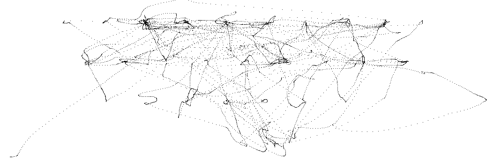
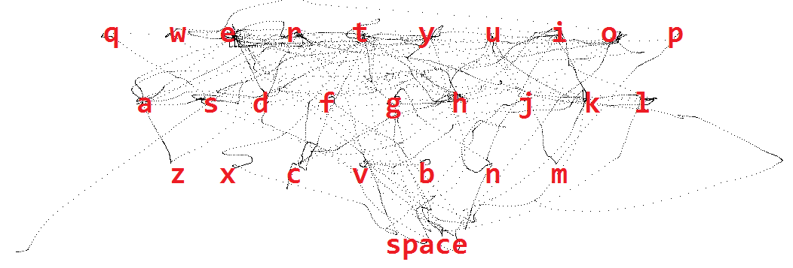

<h1>Boston key party 2015</h1>
<h2>?</h2>
Pour ce challenge, il nous était donné un fichier pcapng contenant un capture d'un flux USB.
La fréquence et la taille des paquets est trop grande pour que ce puisse être une clée USB et trop rapide pour que ce soit un clavier USB.
Nous avons donc pensé que c'était une souris.

c0 44 a9 c7 00 88 ff ff 43 01 81 0c 02 00 2d 00 
7f 99 ea 54 00 00 00 00 d3 6d 06 00 00 00 00 00 
04 00 00 00 04 00 00 00 00 00 00 00 00 00 00 00 
08 00 00 00 00 00 00 00 04 02 00 00 00 00 00 00 
00 02 ff 00

L'information du mouvement de la souris semble être stocké dans les 4 derniers octets de chaque paquet : 
octet 1 : boolean :  
	- 0 : pas de click
	- 1 : click gauche
	- 2 : click droit ? (pas dans la capture donnée)
octet 2 : signed int : mouvement de la souris sur l'axe X
octet 3 : signed int : mouvement de la souris sur l'axe Y
octet 4 : molette ? (il est toujours à 0 sur la capture donnée)

'''python
	#!/usr/bin/env python
	# -*- encode:UTF-8 -*-

	import binascii
	import dpkt
	import struct
	import sys
	import Image

	FILENAME = "pcapImage.bmp"
	SIZE = 5000
	INIT_X, INIT_Y = 1000, 1000

	f = open('usb.pcap', 'rb')
	pcap = dpkt.pcap.Reader(f)

	picture = Image.open(FILENAME)
	pix = picture.load()

	x, y = INIT_X, INIT_Y

	for ts, buf in pcap:
		urb_id = ''.join(reversed(buf[:8]))

		if binascii.hexlify(urb_id) != 'ffff8800c7a944c0':
			continue

		device_id, = struct.unpack('b', buf[0x0B])

		if device_id != 12:
			continue

		data_present, = struct.unpack('b', buf[0x0F])

		if data_present != 0:
			continue

		data_length, = struct.unpack('<I', buf[0x24:0x28])

		data_position = struct.unpack('bbbb', buf[-4:])
		
		
		mov_x = data_position[1]
		mov_y = data_position[2]	
		
		x = x + mov_x
		y = y + mov_y
		
		if x>=SIZE:
			x=SIZE-1
		if y>=SIZE:
			y=SIZE-1
		if x<0:
			x=0
		if y<0:
			y=0
		pix[x, y] = (0, 0, 0, 255)

	picture.save(FILENAME, "PNG")
	f.close()
'''

L'image obtenu est alors : 

Nous avons compris au bout de quelques minutes qu'il s'agissait d'un clavier virtuel qwerty.

En relevant la position du curseur à chaque clic, nous avont trouvé le message suivant : 

THE QUICK BROWN FOX JUMPS OVER THE LAZY DOG THEKEYISIHEARDYOULIKEDSKETCHYETCHINGLASTYEAR

"THE QUICK BROWN FOX JUMPS OVER THE LAZY DOG" est une phrase contenant toutes les lettres de l'alphabet.
Et la clée était évidemment IHEARDYOULIKEDSKETCHYETCHINGLASTYEAR.

