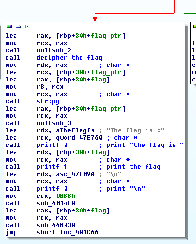
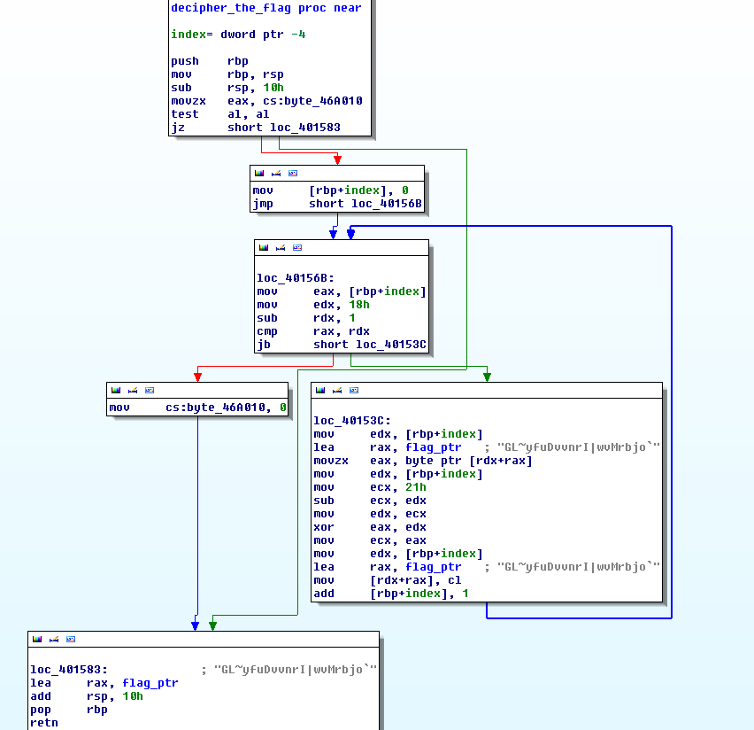

<h1>ECTF</h1>
<h2>reverse100</h2>
The file is a windows 64bit executable.<br />
So let's do some static analysis with IDA.

The interesting code start at offset 0x0000000000401590.<br />
A valid e-mail is asked and then a password.

I didn't have any windows 64bit virtual machine to debug the app so I decided to look ahead.<br />
I found what seems to be a 'print "The flag is :"' function

Here's the block annotated : 



And the decipher function : 



So, using python, I rebuilt it : 

```python
	code = [0x47, 0x4C, 0x7E, 0x79, 0x66, 0x75, 0x44, 0x76, 0x76, 0x6E, 0x72, 
	0x49, 0x7C, 0x77, 0x76, 0x4D, 0x72, 0x62, 0x6A, 0x6F, 0x60, 0x7F, 0x76]
	decipheredStr = ""

	for i in range(0,len(code)):
		key = 0x21 - i
		decipheredStr = decipheredStr + chr(code[i]^key)
	print("==> " + decipheredStr)
```

==> flag{i_love_ice_creams}