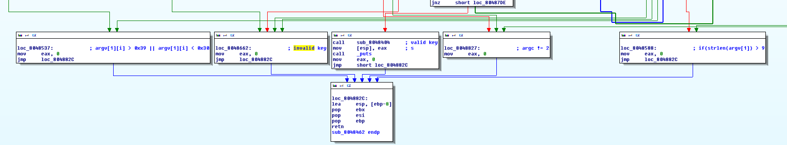
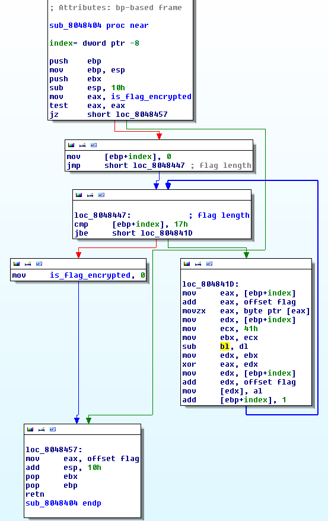

<h1>ECTF</h1>
<h2>reverse200</h2>

The file is a linux 32 bit file.

The main function start at offset 0x08048462.

It begin by checking arguments number and size.

Then there is a kind of key computation.

Finaly there are differents exits if the arguments aren't valid, if the key isn't valid and if key is valid



So when the key is correct, the function sub_8048404 is called

It decypher the flag : 



The same function in python : 

```python
	code = [0x27, 0x2c, 0x5e, 0x59, 0x46, 0x7F, 0x5A, 0x48, 0x5C, 0x67, 0x51, 
	0x59, 0x47, 0x6B, 0x5C, 0x5C, 0x54, 0x6F, 0x42, 0x41, 0x5F, 0x49, 0x14, 0x57]
	decipheredStr = ""

	for i in range(0,len(code)):
		key = 0x41 - i
		decipheredStr = decipheredStr + chr(code[i]^key)
	print("==> " + decipheredStr)
```

==> flag{Care_for_one_more?}