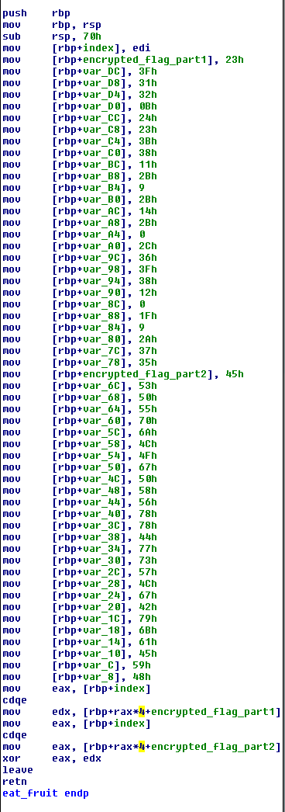

<h1>ECTF</h1>
<h2>reverse300</h2>

The file is an ELF 64bit executable

The program begin by create a flag file (offset 00000000004032BF).

Later it write into the result of the eat_fruit function : 


Like in the previous challenges of this CTF, this is a decypher function :



The same function in python : 

```python
	a = [0x23, 0x3F, 0x31, 0x32, 0x0B, 0x24, 0x23, 0x3B, 0x38, 0x11,
	0x2B, 0x9, 0x2B, 0x14, 0x2B, 0x0, 0x2C, 0x36, 0x3F, 0x38, 0x12,
	0x0, 0x1F, 0x9, 0x2A, 0x37, 0x35]
	b = [0x45, 0x53, 0x50, 0x55, 0x70, 0x6A, 0x4C, 0x4F, 0x67, 0x50,
	0x58, 0x56, 0x78, 0x78, 0x44, 0x77, 0x73, 0x57, 0x4C, 0x67, 0x42,
	0x79, 0x6B, 0x61, 0x45, 0x59, 0x48]
	out = ""

	for i in range(0, len(a)):
		out = out + chr(a[i] ^ b[i])
	print("==> " + out)
```

==> flag{Not_As_Slow_as_Python}